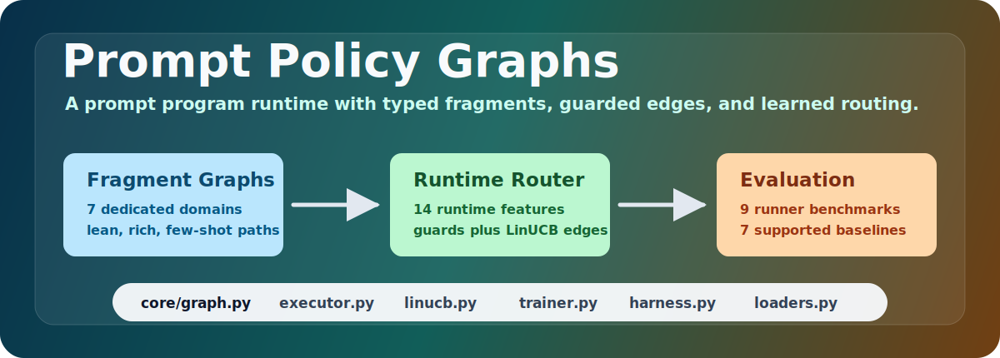
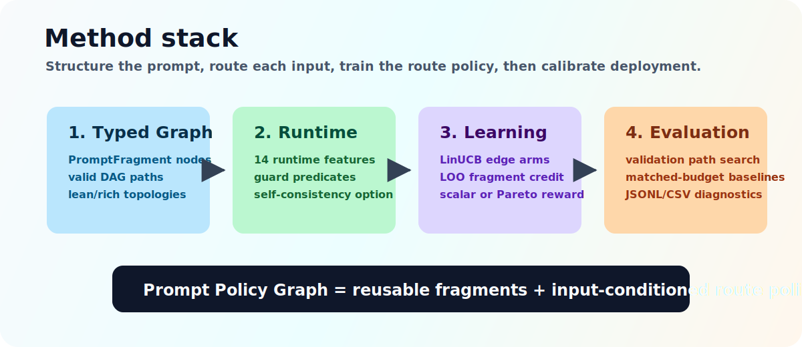
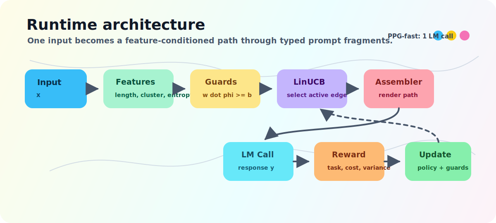
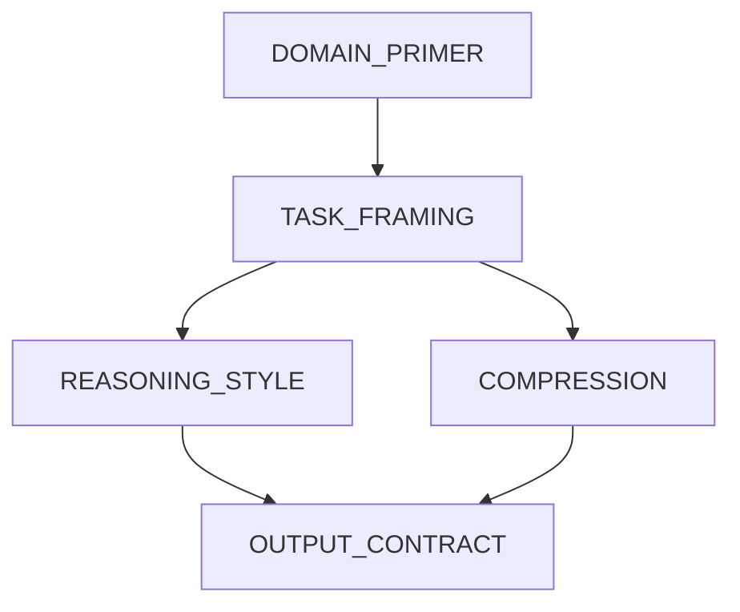
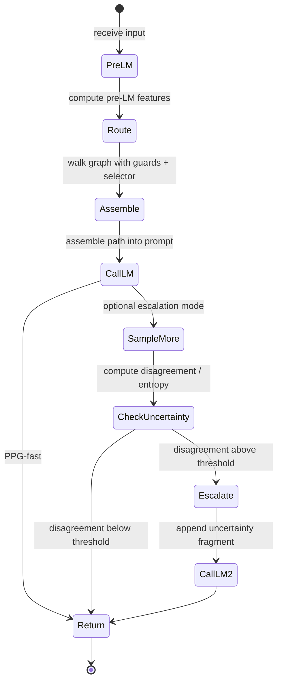
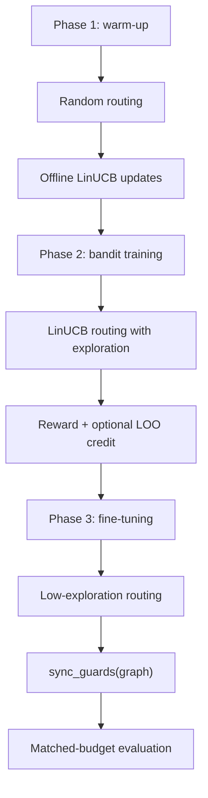
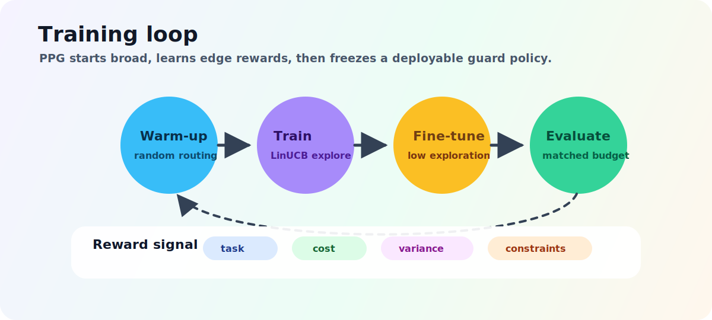
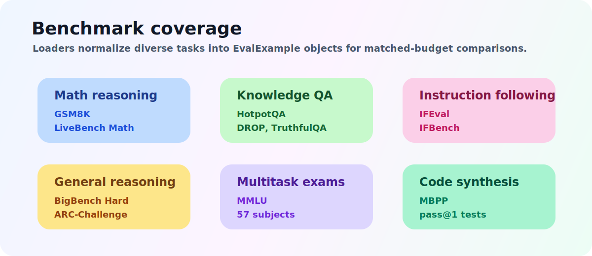

# Prompt Policy Graphs




Prompt Policy Graphs, or PPG, is a research prototype for learning adaptive prompt
programs instead of optimizing one flat prompt string. A PPG represents a prompt as a
typed directed acyclic graph of reusable fragments, executes it with guard-gated runtime
routing, and trains the route policy with an edge-factored contextual bandit under a
multi-objective reward.

The method combines three ideas:

| Component | Role in PPG | Repository module |
| --- | --- | --- |
| Typed prompt graph | Structures prompts as typed fragments and valid graph paths | `ppg/core/graph.py`, `ppg/data/fragments.py` |
| FSM-style runtime | Executes prompt fragments conditionally using guards over runtime features | `ppg/core/executor.py`, `ppg/core/features.py` |
| Bandit training | Learns edge preferences from reward, token cost, variance, and constraints | `ppg/bandits/linucb.py`, `ppg/training/` |

PPG is designed for experiments on benchmarks such as GSM8K, IFEval, IFBench,
HotpotQA, DROP, MBPP, TruthfulQA, BigBench Hard, ARC-Challenge, LiveBench Math, and
MMLU. The codebase currently provides the core framework, seed prompt graphs, dataset
loaders, reward functions, ablation runners, and baseline hooks needed to turn the
method into a full paper-grade evaluation.

> Research note: this repository is an implementation of the proposed method. It should
> not be read as a SOTA claim until large-scale benchmark results, statistical testing,
> and official benchmark scorers are run and reported.

## Table Of Contents

- [Why PPG](#why-ppg)
- [Method Overview](#method-overview)
- [Architecture](#architecture)
- [Installation](#installation)
- [Quickstart](#quickstart)
- [Training](#training)
- [Evaluation](#evaluation)
- [Ablations](#ablations)
- [Benchmark Support](#benchmark-support)
- [External Baselines](#external-baselines)
- [Project Structure](#project-structure)
- [Research Roadmap](#research-roadmap)
- [Development](#development)
- [Known Limitations](#known-limitations)

## Why PPG

Most prompt optimization methods search over a single prompt string. That makes every
change global: a phrase added for difficult math examples also affects easy examples;
instructions added for robustness increase token cost everywhere; and credit assignment
is hard because the final prompt is one undifferentiated blob.

PPG breaks that flat-string assumption.

Instead of asking, "What is the best prompt?", PPG asks:

1. Which typed fragments should exist?
2. Which path through the graph should a given input take?
3. Which guards should fire under runtime uncertainty?
4. Which fragments deserve credit for task accuracy, token efficiency, and robustness?

That turns prompt optimization into a structured policy-learning problem.

## Method Overview



PPG defines a prompt as a graph:

```text
node  = PromptFragment(type, template, token_count, utility)
edge  = Guard(weights, bias)
path  = source-to-terminal fragment sequence
guard = 1[weights . phi >= bias]
phi   = runtime feature vector
```

The graph topology is frozen during training. The learned parts are:

- edge arm parameters in `LinUCBPolicy`;
- guard weights synced from learned edge weights;
- fragment utilities from leave-one-out credit assignment.

The reward is multi-objective:

```text
R = r_task + lambda_constraint * r_constraint
    - lambda_cost * normalized_tokens
    - lambda_variance * perturbation_variance
```

This lets a trained PPG prefer prompts that are accurate, short, instruction-following,
and less brittle under input perturbations.

## Architecture

The colored SVG below is the high-level runtime picture. The Mermaid diagrams that
follow keep the architecture editable directly in Markdown.



### System Flow


### Rich Prompt Graph Topology



The seed library supports a lean topology and a rich topology:

| Topology | Shape | Intended use |
| --- | --- | --- |
| `lean` | `TASK_FRAMING -> REASONING_STYLE -> OUTPUT_CONTRACT` | Fast sanity checks and topology ablations |
| `rich` | Adds `DOMAIN_PRIMER` and `COMPRESSION` branch | Main PPG experiments |

### Runtime FSM



`PPG-fast` is the default and uses one LM call per example. Optional escalation mode can
sample multiple responses, compute disagreement, and make one additional call with an
uncertainty-escalation fragment.

### Training Loop



## Installation

Clone the repository:

```bash
git clone https://github.com/harshad317/PPG.git
cd PPG
```

Create and activate a virtual environment:

```bash
python3.11 -m venv .venv
source .venv/bin/activate
```

Install the package in editable mode:

```bash
pip install -e ".[dev]"
```

Optional dependencies:

```bash
pip install -e ".[progress]"   # tqdm and rich progress displays
pip install -e ".[baselines]"  # DSPy/MIPROv2 and GEPA wrappers
pip install -e ".[local-lm]"   # transformers, vLLM, torch
```

For API-backed runs, set one or both keys:

```bash
export OPENAI_API_KEY="..."
export ANTHROPIC_API_KEY="..."
```

## Quickstart

This minimal example builds a GSM8K graph, routes one input through PPG, and prints the
assembled prompt path.

```python
from ppg.bandits import LinUCBPolicy
from ppg.core import ExecutorConfig, FeatureExtractor, PPGExecutor
from ppg.data import build_graph


class FixedLM:
    def complete(self, prompt: str) -> str:
        return "#### 42"


graph = build_graph("gsm8k", topology="rich")
policy = LinUCBPolicy(graph, alpha=0.5)

executor = PPGExecutor(
    graph=graph,
    selector=policy,
    lm=FixedLM(),
    feature_extractor=FeatureExtractor(),
    config=ExecutorConfig(escalation_enabled=False),
)

trace = executor.execute(
    "If a box has 20 pencils and Sam adds 22 more, how many pencils are there?",
    train_mode=False,
)

print(trace.lm_response)
print(trace.token_count)
print([graph.nodes[node_id].type.value for node_id in trace.node_ids])
```

Use a real OpenAI client with disk caching:

```python
from ppg.lm import DiskCachedLMClient, OpenAIClient, OpenAIConfig

base_lm = OpenAIClient(OpenAIConfig(model="gpt-4o-mini", temperature=0.0))
lm = DiskCachedLMClient(base_lm, cache_path=".cache/lm_cache.json")
```

## Training



PPG training uses `PPGTrainer`, which runs three phases:

| Phase | Selector | Purpose |
| --- | --- | --- |
| Warm-up | Random routing | Explore graph edges and seed the bandit |
| Train | LinUCB with exploration | Learn edge rewards under the multi-objective reward |
| Fine-tune | LinUCB with low exploration | Stabilize the learned route policy |

Example:

```python
from ppg.bandits import LinUCBPolicy
from ppg.core import ExecutorConfig, FeatureExtractor, PPGExecutor
from ppg.core.executor import PromptAssembler
from ppg.data import build_graph
from ppg.training.credit import CreditAssigner, CreditAssignerConfig
from ppg.training.reward import NumericExactMatchMetric, RewardComputer, RewardConfig
from ppg.training.trainer import PPGTrainer, TrainerConfig, TrainingExample


graph = build_graph("gsm8k", topology="rich")
policy = LinUCBPolicy(graph, alpha=0.5)

executor = PPGExecutor(
    graph=graph,
    selector=policy,
    lm=lm,
    feature_extractor=FeatureExtractor(),
    config=ExecutorConfig(escalation_enabled=False),
)

assembler = PromptAssembler(graph)
metric = NumericExactMatchMetric()

reward = RewardComputer(
    task_metric=metric,
    lm=lm,
    assembler=assembler,
    config=RewardConfig(
        lambda_cost=0.001,
        lambda_variance=0.1,
        skip_variance=False,
    ),
)

credit = CreditAssigner(
    lm=lm,
    assembler=assembler,
    task_metric=metric,
    config=CreditAssignerConfig(p_ablate=0.15),
)

trainer = PPGTrainer(
    executor=executor,
    policy=policy,
    reward_computer=reward,
    credit_assigner=credit,
    config=TrainerConfig(
        n_warmup_episodes=200,
        n_train_episodes=1000,
        n_finetune_episodes=200,
        checkpoint_dir="checkpoints/gsm8k",
        show_progress=True,
    ),
)

trainset = [
    TrainingExample(x="What is 20 + 22?", y_star="42"),
    TrainingExample(x="A bag has 12 marbles and gets 8 more. Total?", y_star="20"),
]

stats = trainer.train(trainset)
print(stats.summary())
```

After training, the policy writes learned edge weights into graph guards:

```python
policy.sync_guards(graph)
graph.to_json("checkpoints/gsm8k/graph.json")
policy.save("checkpoints/gsm8k/policy.npz")
```

## Evaluation

`EvalHarness` compares trained PPG against matched-budget baselines. The default
internal baselines use one LM call per example, matching `PPG-fast`.

```python
from ppg.eval import EvalConfig, EvalExample, EvalHarness
from ppg.training.reward import NumericExactMatchMetric


testset = [
    EvalExample(x="What is 40 + 2?", y_star="42"),
    EvalExample(x="What is 10 * 5?", y_star="50"),
]

harness = EvalHarness(
    executor=executor,
    metric=NumericExactMatchMetric(),
    lm=lm,
    config=EvalConfig(
        baselines=[
            "flat_all",
            "static_best",
            "random_gating",
            "highest_utility",
        ],
        show_progress=True,
    ),
)

report = harness.evaluate(testset)
print(report.comparison_table())
print(report.winner())
```

Internal baselines:

| Baseline | Meaning |
| --- | --- |
| `flat_all` | Concatenate all graph nodes in topological order |
| `static_best` | Use a fixed path, or greedy highest-utility path when none is supplied |
| `random_gating` | Route with a random selector |
| `highest_utility` | Route greedily using learned fragment utilities |

## Ablations

The ablation runner trains a fresh system for each ablation and evaluates it under the
same metric and LM.

```python
from ppg.ablations.study import AblationStudy
from ppg.training.reward import NumericExactMatchMetric


study = AblationStudy(
    lm=lm,
    metric=NumericExactMatchMetric(),
    train_dataset=trainset,
    test_dataset=testset,
    benchmark="gsm8k",
    ablations=[
        "ppg_full",
        "no_credit",
        "no_variance",
        "no_bandit",
        "lean_topology",
    ],
    show_progress=True,
)

ablation_report = study.run()
print(ablation_report.table())
```

Supported ablations:

| Ablation | Disabled component |
| --- | --- |
| `ppg_full` | Nothing; full system |
| `no_credit` | Leave-one-out fragment credit assignment |
| `no_variance` | Perturbation variance penalty |
| `no_bandit` | LinUCB routing, replaced by random routing |
| `lean_topology` | Rich graph, replaced by 3-node lean graph |

## Benchmark Support



Benchmark loaders live in `ppg/eval/benchmarks/loaders.py`. They convert Hugging Face
datasets into `EvalExample` objects and expose recommended metrics.

| Benchmark | Loader | Default/recommended metric |
| --- | --- | --- |
| GSM8K | `GSM8KLoader` | `NumericExactMatchMetric` |
| IFEval | `IFEvalLoader` | `ExactMatchMetric` + `IFEvalOfficialChecker` (keyword fallback when library absent) |
| IFBench | `IFBenchLoader` | `ExactMatchMetric` + `IFBenchConstraintChecker` (type-dispatched rule verifier) |
| HotpotQA | `HotpotQALoader` | `F1Metric` |
| DROP | `DROPLoader` | `F1Metric` |
| MBPP | `MBPPLoader` | `MBPPPassAtOneMetric` |
| TruthfulQA | `TruthfulQALoader` | `F1Metric` |
| BigBench Hard | `BigBenchHardLoader` | `ExactMatchMetric` |
| ARC-Challenge | `ARCChallengeLoader` | `ExactMatchMetric` |
| LiveBench Math | `LiveBenchMathLoader` | `NumericExactMatchMetric` |
| MMLU | `MMLULoader` | `ExactMatchMetric` |

Example loader usage:

```python
from ppg.eval.benchmarks import GSM8KLoader


loader = GSM8KLoader()
train_examples = loader.load(split="train", n=100, seed=0)
test_examples = loader.load(split="test", n=100, seed=1)
metric = loader.recommended_metric()
```

Security note for MBPP: `MBPPPassAtOneMetric` executes generated Python code in a
subprocess with a wall-clock timeout and (on Unix) 256 MB virtual-memory and CPU-time
limits via `resource.setrlimit`. Use it only in a trusted or isolated environment;
the resource limits reduce but do not eliminate execution risk.

## External Baselines

PPG includes wrappers for stronger external prompt optimizers:

| Baseline | Wrapper | Dependency | Notes |
| --- | --- | --- | --- |
| DSPy MIPROv2 | `MIPROv2Baseline` | `dspy-ai` | Bayesian instruction/few-shot prompt optimization |
| GEPA | `GEPABaseline` | `gepa` | Evolutionary trace/reflection-based prompt adaptation |

Call `MIPROv2Baseline.verify()` or `GEPABaseline.verify()` before `compile()` to confirm the optional package is importable and report its version.

Example integration pattern:

```python
from ppg.eval.external import GEPABaseline, MIPROv2Baseline
from ppg.eval import EvalConfig, EvalHarness


mipro = MIPROv2Baseline(metric=metric, auto="medium")
mipro.compile(trainset=train_examples, seed_instructions="Solve the task carefully.")

gepa = GEPABaseline(
    metric=metric,
    lm_client=lm,
    reflection_lm="openai/gpt-4o",
    max_metric_calls=150,
)
gepa.compile(
    trainset=train_examples,
    valset=test_examples[:50],
    seed_prompt="Solve the task carefully.",
    objective="Maximize task accuracy while keeping prompts concise.",
)

harness = EvalHarness(
    executor=executor,
    metric=metric,
    lm=lm,
    config=EvalConfig(baselines=["miprov2", "gepa"]),
    external_baselines={"miprov2": mipro, "gepa": gepa},
)
```

## Project Structure

```text
ppg/
  core/
    graph.py        # PromptFragment, Guard, PPGraph, PPGraphBuilder
    features.py     # RuntimeFeatures and feature extraction
    executor.py     # FSM execution, routing, prompt assembly
    tokenizer.py    # Token counting (tiktoken cl100k_base with word-split fallback)
  bandits/
    linucb.py       # Edge-factored LinUCB policy
  training/
    reward.py       # Multi-objective reward and metrics
    credit.py       # Leave-one-out fragment credit assignment
    trainer.py      # Three-phase training loop
  data/
    fragments.py    # Seed fragment library and graph builders
  eval/
    harness.py      # Matched-budget evaluation harness
    external.py     # MIPROv2 and GEPA baseline wrappers
    benchmarks/     # Dataset loaders and benchmark metrics
  ablations/
    study.py        # Paper-style ablation runner
  lm/
    clients.py      # OpenAI, Anthropic, and disk-cached LM clients
tests/
  test_core/
  test_bandits/
  test_training/
  test_eval/
  test_ablations/
```

## Research Roadmap

The repository is structured around an ICLR-style empirical story:

1. Show that graph routing improves the accuracy/token Pareto frontier versus flat
   prompts and prompt selection baselines.
2. Show that typed structure prevents degenerate prompt paths.
3. Show that learned guards beat random gating and input-only gating.
4. Show that perturbation variance reward improves robustness under input perturbations.
5. Show that per-node credit assignment identifies useful fragments and helps pruning.
6. Compare against strong optimizers such as MIPROv2 and GEPA under matched budgets.

Suggested paper tables:

| Table | Contents |
| --- | --- |
| Main results | PPG vs flat-all, static-best, random-gating, MIPROv2, GEPA, and task baselines |
| Ablations | `ppg_full`, `no_credit`, `no_variance`, `no_bandit`, `lean_topology` |
| Pareto analysis | Accuracy vs prompt tokens and LM calls |
| Transfer | Train on one task family, evaluate routing behavior on another |
| Interpretability | Edge update counts, guard weights, fragment utility, path heatmaps |

## Development

Run the test suite:

```bash
python3 -m pytest
```

Run Python syntax checks:

```bash
python3 -m py_compile $(find ppg -name "*.py" -print)
```

Run linting when `ruff` is installed:

```bash
ruff check .
```

The last verified local run before this README update was:

```text
642 passed
```

## Known Limitations

- External MIPROv2 and GEPA integrations require optional packages (`dspy-ai`, `gepa`).
  Use the provided `verify()` classmethod on each baseline before calling `compile()`.
- `MBPPPassAtOneMetric` runs generated code in a subprocess with timeout and Unix
  resource limits (256 MB RAM, CPU-seconds). For high-security environments, run
  inside a container or VM.
- The LinUCB regret bound assumes a fixed graph topology, a linear reward model,
  bounded i.i.d. rewards in [0,1], and ||phi||_2 ≤ 1 features. It matches the
  Chu et al. (2011) result and holds per arm; see `ppg/bandits/linucb.py` for
  the precise statement.

## Citation

No citation is available yet. If this becomes a paper, add the BibTeX entry here.
