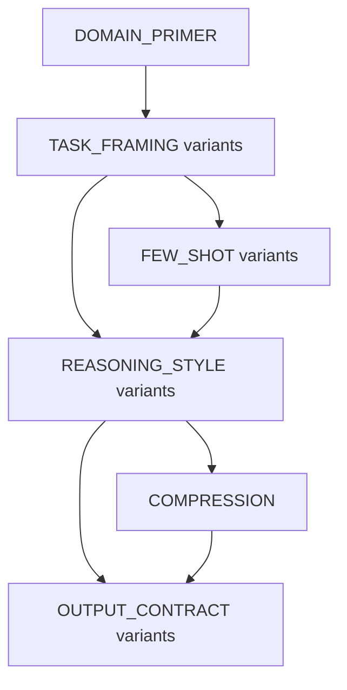

# Prompt Policy Graphs

Prompt Policy Graphs, or PPG, is a research prototype for learning adaptive
prompt programs instead of tuning one flat prompt string. A PPG represents a
prompt as a typed directed acyclic graph of reusable fragments, routes each
input through that graph with runtime features and guarded edges, then trains
the route policy with edge-factored contextual bandits and multi-objective
reward signals.

The repository includes:

| Layer | What is implemented | Main modules |
| --- | --- | --- |
| Typed prompt graphs | Fragment types, graph validation, JSON serialization, lean/rich graph builders | `ppg/core/graph.py`, `ppg/data/fragments.py` |
| Runtime execution | Feature extraction, guard evaluation, LinUCB routing, prompt assembly, optional self-consistency escalation with adaptive early-exit | `ppg/core/features.py`, `ppg/core/executor.py` |
| Training | Warm-up/train/fine-tune loop, LOO fragment credit, reward shaping, GRPO-style updates (adaptive-k), Pareto reward, reflection, evolution, branching | `ppg/training/` |
| Evaluation | Matched-budget harness, validation path search with successive-halving racing, internal baselines, external MIPROv2/GEPA wrappers | `ppg/eval/` |
| Benchmarks | Hugging Face loaders for math, QA, instruction following, code, MCQ, and multitask exams | `ppg/eval/benchmarks/loaders.py` |
| API cost controls | Provider Batch API (-50%), prompt caching, cheaper auxiliary model, adaptive sampling, in-process dedup | `ppg/lm/clients.py`, `COST_REDUCTION.md` |

Research note: this repository implements the proposed method and experiment
scaffolding. It is not a SOTA claim until large-scale benchmark results,
official scorers, confidence intervals, and matched optimization budgets are
reported.

## Table Of Contents

- [Why PPG](#why-ppg)
- [Method](#method)
- [Architecture](#architecture)
- [Installation](#installation)
- [Quickstart](#quickstart)
- [Benchmark Runner](#benchmark-runner)
- [API Cost Controls](#api-cost-controls)
- [Training](#training)
- [Evaluation](#evaluation)
- [Ablations](#ablations)
- [Benchmark Support](#benchmark-support)
- [External Baselines](#external-baselines)
- [Project Structure](#project-structure)
- [Development](#development)
- [Citation](#citation)

## Why PPG

Most prompt optimization methods search over a single prompt string. That makes
each edit global: adding detailed reasoning can help difficult examples but
increase token cost on easy examples; adding strict output instructions can
improve formatting but harm free-form QA; and assigning credit to one useful
phrase is hard because the prompt is one undifferentiated blob.

PPG makes the prompt a policy:

1. Define typed fragments such as `TASK_FRAMING`, `REASONING_STYLE`,
   `OUTPUT_CONTRACT`, `FEW_SHOT`, `COMPRESSION`, and `DOMAIN_PRIMER`.
2. Build a valid graph of possible fragment paths.
3. Extract runtime features from each input.
4. Select edges with learned contextual bandit arms.
5. Reward routes for task score, constraint satisfaction, token cost, and
   robustness.
6. Use fragment-level credit assignment to learn which nodes help or hurt.

The question becomes "which prompt path should this input take?" rather than
"what one prompt should every input use?"

## Method

At the core of PPG:

```text
node  = PromptFragment(type, template, token_count, utility)
edge  = Guard(weights, bias)
path  = source-to-terminal fragment sequence
guard = weights . phi >= bias
phi   = runtime feature vector
```

The default route learner is `LinUCBPolicy`, with one arm per graph edge. During
execution, guards identify traversable successors and LinUCB chooses among
candidate edges using the current feature vector.

The scalar reward path uses:

```text
R = r_task
    + lambda_constraint * r_constraint
    - lambda_cost * normalized_tokens
    - lambda_variance * perturbation_variance
```

`ParetoRewardComputer` is also available for production-style runs. It replaces
linear scalarization with a bounded Pareto archive over task score, constraint
score, token cost, and robustness objectives.

Core graph construction keeps topology fixed while learning guard weights and
fragment utilities. Production mode can optionally evolve fragment text and add
specialized branches from reflection-discovered failure modes.

## Architecture

### Runtime Flow


`PPG-fast` is the default execution mode and makes one LM call per example. The
production executor can enable self-consistency escalation with `k_samples=3`;
when post-LM disagreement exceeds the threshold, the executor appends an
`UNCERTAINTY_ESCALATION` fragment and calls the LM again.

Production also enables **adaptive (early-exit) self-consistency**: samples are
drawn incrementally and sampling stops as soon as the majority answer is settled
(the lead cannot be overturned by the remaining budget, or the top answer holds
`adaptive_confidence` of the votes). Easy inputs cost one or two calls while
ambiguous ones still use the full `k_samples` budget. See
[API Cost Controls](#api-cost-controls).

### Graph Topologies



| Topology | Shape | Intended use |
| --- | --- | --- |
| `lean` | `TASK_FRAMING -> REASONING_STYLE -> OUTPUT_CONTRACT` | Fast sanity checks and topology ablations |
| `rich` | Adds `DOMAIN_PRIMER`, variant branches, and optional `COMPRESSION` | Main PPG experiments |
| `rich` with `include_few_shot=True` | Adds a `FEW_SHOT` layer between task framing and reasoning | In-context learning experiments |

### Feature Vector

`RuntimeFeatures.as_vector()` exposes a fixed 21-dimensional feature schema:

| Feature family | Fields |
| --- | --- |
| Input length | `input_length_norm` |
| Post-LM uncertainty | `sc_disagreement`, `entropy_approx` |
| Verifier/tool state | `verifier_score`, `tool_success`, `tool_failure` |
| Constraint signals | `has_length_constraint`, `has_format_constraint`, `has_keyword_constraint`, `n_constraints_norm` |
| Math/reasoning signals | `has_numeric_input`, `n_arithmetic_ops_norm`, `n_steps_heuristic_norm`, `input_word_count_norm` |
| Domain signals | `is_multiple_choice`, `is_code_task`, `has_adversarial_framing` |
| Input cluster | `embed_cluster_0` through `embed_cluster_3` |

Hash-based clusters are used by default. `FeatureExtractor.production()` lazily
uses sentence-transformer embeddings and MiniBatchKMeans when dependencies are
available.

## Installation

Clone the repository:

```bash
git clone https://github.com/harshad317/PPG.git
cd PPG
```

Create and activate a virtual environment:

```bash
python3.11 -m venv .venv
source .venv/bin/activate
```

Install the package:

```bash
pip install -e ".[dev]"
```

Optional extras:

```bash
pip install -e ".[progress]"   # tqdm and rich progress displays
pip install -e ".[baselines]"  # DSPy/MIPROv2 and GEPA-related wrappers
pip install -e ".[local-lm]"   # transformers, vLLM, torch
```

For API-backed runs:

```bash
export OPENAI_API_KEY="..."
export ANTHROPIC_API_KEY="..."
```

## Quickstart

This example builds a GSM8K graph, routes one input through PPG, and prints the
selected fragment types.

```python
from ppg.bandits import LinUCBPolicy
from ppg.core import ExecutorConfig, FeatureExtractor, PPGExecutor
from ppg.data import build_graph


class FixedLM:
    def complete(self, prompt: str) -> str:
        return "#### 42"


graph = build_graph("gsm8k", topology="rich", include_few_shot=True)
policy = LinUCBPolicy(graph, alpha=0.5)

executor = PPGExecutor(
    graph=graph,
    selector=policy,
    lm=FixedLM(),
    feature_extractor=FeatureExtractor(),
    config=ExecutorConfig(escalation_enabled=False),
)

trace = executor.execute(
    "If a box has 20 pencils and Sam adds 22 more, how many pencils are there?",
    train_mode=False,
)

print(trace.lm_response)
print(trace.token_count)
print([graph.nodes[node_id].type.value for node_id in trace.node_ids])
```

Use an OpenAI client with disk caching:

```python
from ppg.lm import DiskCachedLMClient, OpenAIClient, OpenAIConfig

base_lm = OpenAIClient(OpenAIConfig(model="gpt-4o-mini", temperature=0.0))
lm = DiskCachedLMClient(base_lm, cache_path=".cache/lm_cache.json")
```

Cost-aware client variants (see [API Cost Controls](#api-cost-controls)):

```python
from ppg.lm import (
    AnthropicClient, AnthropicConfig,
    OpenAIBatchClient, BatchLMClient, MemoizingLMClient,
)

# Provider Batch API at -50% for offline (non-interactive) work.
batch_lm = OpenAIBatchClient(OpenAIConfig(model="gpt-4o-mini"))
responses = batch_lm.complete_batch(["prompt a", "prompt b", "prompt c"])

# Prompt caching: cache the static system prefix across repeated calls.
cached_lm = AnthropicClient(AnthropicConfig(
    model="claude-haiku-4-5-20251001", enable_prompt_cache=True,
))

# Add a batch entry point + in-process dedup to any client.
lm = MemoizingLMClient(BatchLMClient(base_lm))
```

## Benchmark Runner

`scripts/run_benchmark.py` loads splits, trains PPG when requested, optionally
calibrates a fixed validation path, evaluates PPG, and writes a JSON result
file. Diagnostic internal baselines run only when explicitly requested.

```bash
# PPG only on GSM8K
python scripts/run_benchmark.py gsm8k --model gpt-4o-mini

# Production PPG with few-shot fragments and parallel workers
python scripts/run_benchmark.py gsm8k \
  --model gpt-4o-mini \
  --production \
  --few-shot \
  --workers 4

# Instruction following with the IFBench constraint checker
python scripts/run_benchmark.py ifbench --model gpt-4o-mini --production

# MMLU, one subject
python scripts/run_benchmark.py mmlu \
  --model gpt-4o-mini \
  --mmlu-subject high_school_biology

# External optimizer only
python scripts/run_benchmark.py gsm8k --model gpt-4o-mini --run-mipro
python scripts/run_benchmark.py gsm8k --model gpt-4o-mini --run-gepa

# PPG plus external optimizers in one run
python scripts/run_benchmark.py gsm8k \
  --model gpt-4o-mini \
  --production \
  --run-mipro \
  --run-gepa \
  --include-ppg
```

Useful flags:

| Flag | Effect |
| --- | --- |
| `--few-shot` | Adds `FEW_SHOT` fragment variants to rich graphs |
| `--ppg-calibration val_path` | Selects the best fixed route on the validation split; default |
| `--ppg-calibration-execution deployment` | Scores calibration paths with the same executor sampling/escalation used at eval time |
| `--ppg-calibration dynamic` | Uses greedy learned routing per test input |
| `--ppg-path-candidates N` | Limits validation path search to the top `N` utility-ranked paths |
| `--ppg-ensemble-paths N` | Lets validation deploy up to `N` majority-vote paths; tied ensembles shrink to the lowest-token size |
| `--ppg-calibration-patience N` | Controls early stopping during validation path search; `0` evaluates all requested candidates |
| `--production` | Enables production configs: adaptive self-consistency escalation, semantic clusters, Pareto reward, adaptive-k GRPO (off in fine-tune), plateau early-stop, reflection, evolution, branching |
| `--sample-temperature T`, `--k-samples N` | Control stochastic self-consistency samples used by production escalation/majority voting |
| `--timeout S`, `--max-retries N`, `--parse-retries N` | Tune provider request timeouts, SDK retries, and extra retries for empty/non-JSON provider responses |
| `--no-reflection`, `--no-evolution`, `--no-branching`, `--no-pareto` | Disable individual production features |
| `--workers N` | Runs episode collection and evaluation LM calls with thread workers |
| `--batch-api` | Routes offline LM calls through the provider Batch API (-50%); offline only, adds latency |
| `--enable-prompt-cache` | Caches the static system prefix (Anthropic) / marks intent (OpenAI auto-caches) to cut repeated input-token cost |
| `--aux-model MODEL` | Routes LOO-credit and perturbation-variance calls to a cheaper model (relative signal only); main path stays on `--model` |
| `--aux-max-tokens N` | `max_tokens` for the auxiliary model's calls (default 256) |
| `--racing-subset K`, `--racing-survivors M` | Successive-halving calibration: pre-score paths on `K` val examples, keep top `M` before full scoring |
| `--run-mipro`, `--run-gepa` | Runs external prompt optimizer baselines |
| `--run-internal-baselines` | Also runs diagnostic internal baselines after PPG |
| `--diagnostic-report` | Prints the full PPG diagnostic report after the score table |
| `--include-ppg` | Includes PPG when running external baselines |
| `--cache-dir DIR`, `--no-cache` | Controls disk caching for LM calls |
| `--output-dir DIR` | Writes result JSON files to `DIR` |

The runner currently supports these benchmark names: `arc_challenge`,
`drop`, `gsm8k`, `hotpotqa`, `ifbench`, `livebench_math`, `mbpp`, `mmlu`,
and `truthfulqa`.

## Suite Runner

Use `scripts/run_suite.py` when evaluating PPG changes. It runs the same
configuration across a benchmark list and summarizes the latest JSON outputs by
mean score, average rank, wins, and PPG delta versus the best non-PPG method.
This is the preferred guardrail against optimizing for a single benchmark.

```bash
# Print the exact commands without spending API calls
python scripts/run_suite.py \
  --profile smoke \
  --model gpt-4.1-mini \
  --production \
  --dry-run

# Production suite with PPG plus GEPA/MIPRO comparisons
python scripts/run_suite.py \
  --profile standard \
  --model gpt-4.1-mini \
  --production \
  --few-shot \
  --run-mipro \
  --run-gepa \
  --include-ppg \
  --benchmarks gsm8k,drop,hotpotqa,truthfulqa,arc_challenge,mmlu

# Summarize existing result files only
python scripts/run_suite.py \
  --model gpt-4.1-mini \
  --benchmarks gsm8k,drop,hotpotqa,truthfulqa,arc_challenge,mmlu \
  --output-dir results_suite \
  --summarize-only
```

## API Cost Controls

LM API calls dominate the cost of training, calibration, and evaluation. The
features below cut that cost while preserving task quality; each is off by
default (or bundled only into `--production`) and gated behind a flag or config
field. The full analysis and call-budget breakdown live in `COST_REDUCTION.md`.

| Control | Where | Enable | Quality note |
| --- | --- | --- | --- |
| Batch API (-50%) | `OpenAIBatchClient`, `BatchLMClient` | `--batch-api` | Output-identical; offline only |
| Prompt caching | `AnthropicConfig.enable_prompt_cache` | `--enable-prompt-cache` | Caches only the static system prefix |
| Cheaper auxiliary model | `aux_lm` on `RewardComputer` / `CreditAssigner` | `--aux-model`, `--aux-max-tokens` | LOO/variance need a relative signal only |
| Adaptive self-consistency | `ExecutorConfig.adaptive_sampling` | on in `--production` | Stops only once the majority is settled |
| Adaptive-k GRPO | `TrainerConfig.grpo_adaptive`, `k_grpo_min` | on in `--production` | Full budget only on uncertain paths |
| No GRPO in fine-tune | `TrainerConfig.k_grpo_paths_finetune` | on in `--production` (=1) | Fine-tune is near-greedy already |
| Plateau early-stop | `TrainerConfig.early_stop_window` | on in `--production` (=200) | Stops a phase only at a reward plateau |
| Calibration racing | `select_path_by_validation(racing_subset, racing_survivors)` | `--racing-subset`, `--racing-survivors` | Winner still validated on full val split |
| In-process dedup | `MemoizingLMClient` | auto when `--no-cache` | Deterministic prompts only (`temperature=0`) |

GRPO sampling is the single largest source of LM calls in production training,
so the adaptive-k and fine-tune controls have the biggest impact. Batch API and
prompt caching compound on top of every remaining call. A full cost-aware
production run:

```bash
python scripts/run_benchmark.py gsm8k --model gpt-4.1-mini --production \
  --batch-api --enable-prompt-cache \
  --aux-model gpt-4o-mini --aux-max-tokens 256 \
  --racing-subset 25 --racing-survivors 8
```

The batch entry point `complete_batch` is forwarded and deduplicated by
`DiskCachedLMClient`, `MemoizingLMClient`, `CountingLMClient`, and the
perturbation-variance path, so wrapping a native Batch backend propagates
everywhere automatically.

## Training

`PPGTrainer` runs three phases:

| Phase | Selector | Purpose |
| --- | --- | --- |
| Warm-up | `RandomSelector` | Explore graph edges and seed the bandit |
| Train | `LinUCBPolicy` with exploration | Learn route preferences under reward feedback |
| Fine-tune | `LinUCBPolicy` with low exploration | Stabilize the route policy and fragment utilities |

Minimal training example:

```python
from ppg.bandits import LinUCBPolicy
from ppg.core import ExecutorConfig, FeatureExtractor, PPGExecutor
from ppg.core.executor import PromptAssembler
from ppg.data import build_graph
from ppg.training import (
    CreditAssigner,
    CreditAssignerConfig,
    NumericExactMatchMetric,
    PPGTrainer,
    RewardComputer,
    RewardConfig,
    TrainerConfig,
    TrainingExample,
)


graph = build_graph("gsm8k", topology="rich")
policy = LinUCBPolicy(graph, alpha=0.5)

executor = PPGExecutor(
    graph=graph,
    selector=policy,
    lm=lm,
    feature_extractor=FeatureExtractor(),
    config=ExecutorConfig(escalation_enabled=False),
)

assembler = PromptAssembler(graph)
metric = NumericExactMatchMetric()

reward = RewardComputer(
    task_metric=metric,
    lm=lm,
    assembler=assembler,
    config=RewardConfig(lambda_cost=0.001, lambda_variance=0.1),
)

credit = CreditAssigner(
    lm=lm,
    assembler=assembler,
    task_metric=metric,
    config=CreditAssignerConfig(p_ablate=0.15),
)

trainer = PPGTrainer(
    executor=executor,
    policy=policy,
    reward_computer=reward,
    credit_assigner=credit,
    config=TrainerConfig(
        n_warmup_episodes=200,
        n_train_episodes=1000,
        n_finetune_episodes=500,
        checkpoint_dir="checkpoints/gsm8k",
        show_progress=True,
    ),
)

trainset = [
    TrainingExample(x="What is 20 + 22?", y_star="42"),
    TrainingExample(x="A bag has 12 marbles and gets 8 more. Total?", y_star="20"),
]

stats = trainer.train(trainset)
print(stats.summary())
```

After training:

```python
policy.sync_guards(graph)
graph.to_json("checkpoints/gsm8k/graph.json")
policy.save("checkpoints/gsm8k/policy.npz")
```

### Production Training Features

Production mode in the runner wires together these optional components:

| Component | Implementation | Purpose |
| --- | --- | --- |
| Adaptive self-consistency | `ExecutorConfig.production()` | Samples multiple responses, majority-votes normalized answers, escalates on high disagreement, and stops sampling early once the majority is settled |
| Semantic clusters | `FeatureExtractor.production()` | Uses sentence-transformer embeddings when available |
| Adaptive-k GRPO updates | `TrainerConfig.k_grpo_paths > 1`, `grpo_adaptive`, `k_grpo_paths_finetune` | Updates paths with group-relative advantages; full sample budget only on uncertain paths, disabled in the near-greedy fine-tune phase |
| Mixed-model auxiliary calls | `aux_lm` on `RewardComputer` / `CreditAssigner` | Routes LOO-credit and perturbation-variance rollouts to a cheaper model |
| Plateau early-stop | `TrainerConfig.early_stop_window` | Halts a phase once mean reward stops improving |
| Pareto reward | `ParetoRewardComputer` | Avoids fixed scalar weights by ranking objective vectors |
| Reflection | `ReflectionLoop` | Diagnoses failed episodes and annotates fragments |
| Evolution | `FragmentEvolver` | Mutates low-utility fragment templates |
| Branching | `FailureModeBrancher` | Adds specialized branches for repeated failure modes |
| Logging | `PPGLogger` | Writes JSONL events, CSV episodes, optional W&B logs, and diagnostics |

## Evaluation

`EvalHarness` can compare trained PPG against matched-budget baselines. The
internal baselines all use one LM call per example, matching `PPG-fast`, and
are opt-in from `scripts/run_benchmark.py` via `--run-internal-baselines`.

```python
from ppg.eval import EvalConfig, EvalExample, EvalHarness
from ppg.training import NumericExactMatchMetric


testset = [
    EvalExample(x="What is 40 + 2?", y_star="42"),
    EvalExample(x="What is 10 * 5?", y_star="50"),
]

harness = EvalHarness(
    executor=executor,
    metric=NumericExactMatchMetric(),
    lm=lm,
    config=EvalConfig(
        baselines=[
            "flat_all",
            "static_best",
            "random_gating",
            "highest_utility",
        ],
        show_progress=True,
    ),
)

report = harness.evaluate(testset)
print(report.comparison_table())
print(report.winner())
```

Internal baselines:

| Baseline | Meaning |
| --- | --- |
| `flat_all` | Concatenates all graph nodes in topological order |
| `static_best` | Uses a fixed path, or greedy highest-utility path when none is supplied |
| `random_gating` | Routes with a random selector |
| `highest_utility` | Routes greedily using learned fragment utilities |

Validation path calibration is implemented in `ppg/eval/path_search.py`.
`select_path_by_validation()` enumerates complete graph paths, ranks them by
learned utility, scores candidate paths on validation examples, and returns a
fixed deployment path.

For stronger deployment, the benchmark runner can also validate a small method
portfolio and report the selected winner as `ppg_portfolio`:

```bash
python scripts/run_benchmark.py gsm8k \
  --model gpt-4o-mini \
  --production \
  --ppg-portfolio \
  --portfolio-min-margin 0.01
```

This uses validation-only evidence to choose among PPG, `base_model`,
`flat_all`, `static_best`, and `highest_utility`. The margin keeps PPG when a
challenger's validation gain is too small to trust.

## Ablations

The ablation framework trains a fresh system for each ablation and evaluates it
under the same metric and LM.

```python
from ppg.ablations import AblationStudy
from ppg.training import NumericExactMatchMetric


study = AblationStudy(
    lm=lm,
    metric=NumericExactMatchMetric(),
    train_dataset=trainset,
    test_dataset=testset,
    benchmark="gsm8k",
    ablations=[
        "ppg_full",
        "no_credit",
        "no_variance",
        "no_bandit",
        "lean_topology",
    ],
    show_progress=True,
)

ablation_report = study.run()
print(ablation_report.table())
```

Supported ablations:

| Ablation | Disabled or changed component |
| --- | --- |
| `ppg_full` | Full scalar-reward PPG |
| `no_credit` | Leave-one-out fragment credit assignment |
| `no_variance` | Perturbation variance penalty |
| `no_bandit` | LinUCB routing, replaced by random routing |
| `lean_topology` | Rich graph replaced by a 3-node lean graph |

## Benchmark Support

Benchmark loaders convert Hugging Face datasets into `EvalExample` objects and
expose recommended metrics or constraint checkers.

| Benchmark | Runner support | Loader | Default scoring | Fragment graph |
| --- | --- | --- | --- | --- |
| GSM8K | Yes | `GSM8KLoader` | `NumericExactMatchMetric` | Dedicated |
| IFBench | Yes | `IFBenchLoader` | `IFBenchConstraintChecker` via constraint scoring | Dedicated |
| IFEval | Loader only | `IFEvalLoader` | `IFEvalOfficialChecker` when installed, keyword fallback otherwise | None |
| TruthfulQA | Yes | `TruthfulQALoader` | `F1Metric` | Dedicated |
| ARC-Challenge | Yes | `ARCChallengeLoader` | `MultipleChoiceMetric` | Dedicated |
| LiveBench Math | Yes | `LiveBenchMathLoader` | `NumericExactMatchMetric` | Dedicated |
| HotpotQA | Yes | `HotpotQALoader` | `F1Metric` | Dedicated |
| MBPP | Yes | `MBPPLoader` | `MBPPPassAtOneMetric` | Dedicated |
| DROP | Yes | `DROPLoader` | `F1Metric` | Fallback to HotpotQA graph |
| MMLU | Yes | `MMLULoader` | `MultipleChoiceMetric` | Fallback to GSM8K graph |

Example loader usage:

```python
from ppg.eval.benchmarks import GSM8KLoader


loader = GSM8KLoader()
train_examples = loader.load(split="train", n=100, seed=0)
test_examples = loader.load(split="test", n=100, seed=1)
metric = loader.recommended_metric()
```

Security note for MBPP: `MBPPPassAtOneMetric` executes generated Python code in
a subprocess with a wall-clock timeout and, on Unix, 256 MB virtual-memory and
CPU-time limits via `resource.setrlimit`. Use it only in a trusted or isolated
environment; the resource limits reduce but do not eliminate execution risk.

## External Baselines

PPG includes wrappers for external prompt optimizers:

| Baseline | Wrapper | Notes |
| --- | --- | --- |
| DSPy MIPROv2 | `MIPROv2Baseline` | Bayesian instruction and few-shot prompt optimization |
| GEPA | `GEPABaseline` | DSPy GEPA-style evolutionary prompt adaptation with reflection feedback |

Call `MIPROv2Baseline.verify()` or `GEPABaseline.verify()` before long runs to
confirm that optional packages are importable.

```python
from ppg.eval import EvalConfig, EvalHarness
from ppg.eval.external import GEPABaseline, MIPROv2Baseline


print(MIPROv2Baseline.verify())
print(GEPABaseline.verify())

mipro = MIPROv2Baseline(metric=metric, auto="medium")
mipro.compile(trainset=train_examples, valset=val_examples, seed_instructions="Solve carefully.")

gepa = GEPABaseline(
    metric=metric,
    reflection_lm="openai/gpt-4o",
    max_metric_calls=150,
)
gepa.compile(
    trainset=train_examples,
    valset=val_examples,
    seed_instructions="Solve carefully.",
)

harness = EvalHarness(
    executor=executor,
    metric=metric,
    lm=lm,
    config=EvalConfig(baselines=["miprov2", "gepa"]),
    external_baselines={"miprov2": mipro, "gepa": gepa},
)
```

## Project Structure

```text
ppg/
  core/
    graph.py          # PromptFragment, Guard, PPGraph, PPGraphBuilder
    features.py       # RuntimeFeatures and feature extraction
    executor.py       # FSM execution, routing, prompt assembly
    tokenizer.py      # Token counting with tiktoken fallback
  bandits/
    linucb.py         # Edge-factored LinUCB policy
  training/
    reward.py         # Metrics, constraint checkers, scalar and Pareto rewards
    credit.py         # Leave-one-out fragment credit assignment
    trainer.py        # Three-phase trainer, GRPO updates, parallel collection
    reflection.py     # Failure diagnosis and fragment annotations
    evolution.py      # Fragment mutation and crossover
    branching.py      # Failure-mode branch insertion
    meta_learning.py  # Cross-benchmark policy initialization experiments
  data/
    fragments.py      # Seed fragment library and graph builders
  eval/
    harness.py        # Matched-budget evaluation harness
    path_search.py    # Validation path calibration
    external.py       # MIPROv2 and GEPA wrappers
    benchmarks/       # Dataset loaders and benchmark metrics
  ablations/
    study.py          # Paper-style ablation runner
  lm/
    clients.py        # OpenAI, Anthropic, counting, disk-cached, memoizing, and batch (-50%) clients
  logging_utils.py    # JSONL/CSV/W&B logging and diagnostic reports
scripts/
  run_benchmark.py    # End-to-end benchmark runner
tests/
  test_core/
  test_bandits/
  test_training/
  test_eval/
  test_ablations/
  test_data/
  test_lm/
  test_cost_reduction.py   # batch/dedup, prompt cache, adaptive-k GRPO, aux routing, adaptive SC, racing
```

The cost-reduction analysis and call-budget breakdown are documented in
`COST_REDUCTION.md`.

## Development

Run the test suite:

```bash
python3 -m pytest
```

Run Python syntax checks:

```bash
python3 -m py_compile $(find ppg scripts -name "*.py" -print)
```

Run linting when `ruff` is installed:

```bash
ruff check .
```

Last verified local run:

```text
761 passed in 2.14s
```

## Citation

No citation is available yet. If this becomes a paper, add the BibTeX entry
here.
